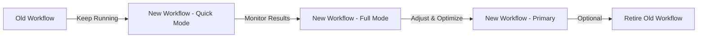

# Mobile Quality Improvements - Summary

## 📋 Overview

This document summarizes the quality and performance improvements made to the **mobile** folder workflow in the `refactor/performance-fixes-v2` branch.

## 🎯 Changes Made

### 1. New Enhanced Workflow: `mobile-quality-gate.yml`

**Location**: `.github/workflows/mobile-quality-gate.yml`

**Features**:
- ✅ **Comprehensive Code Analysis**: Flutter analyze + Dart analysis
- ✅ **Code Formatting Check**: Ensures consistent style with dart format
- ✅ **Unit Testing with Coverage**: Minimum 60% coverage threshold
- ✅ **Performance Benchmarks**: Measures app performance
- ✅ **Duplicate Code Detection**: Using jscpd to find code duplication
- ✅ **Security Scanning**: Basic security checks for dependencies
- ✅ **Code Complexity Analysis**: Using Lizard and Radon tools
- ✅ **Detailed Reporting**: Comprehensive GitHub summaries and artifacts

**Check Levels**:
- **quick** (~5 min): Format + Analysis + Tests
- **full** (~15 min): All checks + Duplicate detection + Security + Complexity
- **performance** (~8 min): Format + Analysis + Benchmarks only

### 2. Enhanced Analysis Options

**Location**: `mobile/analysis_options.yaml`

**New Rules Added**:
```yaml
# Performance Optimization Rules
avoid_unnecessary_containers: true
prefer_const_constructors: true
prefer_const_constructors_in_immutables: true
prefer_const_literals_to_create_immutables: true
use_build_context_synchronously: true
avoid_slow_async_io: true

# Flutter Best Practices
prefer_const_declarations: true
avoid_unnecessary_setstate: true
prefer_final_fields: true
prefer_final_locals: true
```

### 3. Updated Existing Workflow

**Location**: `.github/workflows/quality.yml`

**Changes**:
- Added `java_version: '17'` parameter to Flutter CI job
- Ensured compatibility with the new mobile quality gate

### 4. Comprehensive Documentation

**New Files**:
- `.github/workflows/MOBILE_WORKFLOW_GUIDE.md` - Complete guide for the new workflow
- `MOBILE_QUALITY_IMPROVEMENTS.md` - This summary document

## 🚀 How to Use

### Running the New Workflow

1. **Automatic Trigger**: The workflow runs automatically on:
   - Pushes to any branch (when mobile files change)
   - Pull requests (when mobile files change)

2. **Manual Trigger**:
   - Go to **Actions** tab in GitHub
   - Select **Mobile Quality Gate - Enhanced**
   - Click **Run workflow**
   - Choose your options:
     - Check Level: quick, full, or performance
     - Run Tests: Enable/disable
     - Minimum Coverage: Set threshold (default: 60%)
     - Upload Reports: Enable/disable
     - Run Benchmarks: Enable/disable

### For Developers

**Before Pushing Code**:
```bash
cd mobile
# Check formatting
dart format lib test

# Run static analysis
flutter analyze lib

# Run tests with coverage
flutter test --coverage

# Run build runner
dart run build_runner build --delete-conflicting-outputs
```

**Fixing Common Issues**:
```bash
# Fix formatting issues
dart format lib test

# Fix analysis warnings
flutter analyze lib

# Improve test coverage
flutter test --coverage
```

## 📊 Quality Metrics

### Code Coverage
- **Minimum Threshold**: 60%
- **Recommended**: >80%
- **Measurement**: Using lcov for coverage reporting

### Performance Metrics
- **Benchmark Tests**: Located in `test/performance/`
- **Tools Used**: Flutter test framework
- **Recommendations**: 
  - Use `const` constructors where possible
  - Implement `shouldRepaint` in custom widgets
  - Dispose controllers and streams properly
  - Optimize image sizes and formats

### Code Quality Metrics
- **Duplicate Code**: Detected using jscpd
- **Code Complexity**: Measured using Lizard and Radon
- **Security**: Basic dependency scanning

## 📈 Benefits

### For the Team
1. **Consistent Code Quality**: All code follows the same standards
2. **Early Bug Detection**: Issues caught before they reach production
3. **Performance Optimization**: Continuous performance monitoring
4. **Better Maintainability**: Clean, well-structured code
5. **Security**: Basic security checks integrated

### For the Project
1. **Higher Quality**: Fewer bugs and issues in production
2. **Better Performance**: Optimized code runs faster
3. **Easier Maintenance**: Consistent code is easier to maintain
4. **Faster Development**: Automated checks reduce manual review time
5. **Professional Standards**: Meets enterprise-grade quality requirements

## 🔧 Configuration

### Customizing the Workflow

Edit `.github/workflows/mobile-quality-gate.yml`:

```yaml
env:
  FLUTTER_VERSION: '3.44.4'    # Change Flutter version
  DART_VERSION: '3.8.0'        # Change Dart version
  WORKING_DIRECTORY: 'mobile'  # Change project directory
  MIN_COVERAGE: 60             # Change default coverage threshold
```

### Customizing Analysis Rules

Edit `mobile/analysis_options.yaml`:

```yaml
analyzer:
  errors:
    # Add your custom error rules here
    
linter:
  rules:
    # Add your custom lint rules here
```

## 🛠️ Troubleshooting

### Common Issues and Solutions

#### 1. Workflow Fails on Formatting
**Solution**: Run `dart format lib test` locally and commit the changes

#### 2. Coverage Below Threshold
**Solutions**:
- Write more tests
- Increase the `min_coverage` threshold
- Exclude generated files from coverage

#### 3. Analysis Errors
**Solution**: Fix the reported issues or add appropriate ignore comments

#### 4. Test Failures
**Solution**: Fix the failing tests or investigate test environment issues

#### 5. Performance Issues
**Solution**: Optimize your code following Flutter best practices

## 📚 Resources

### Documentation
- [Mobile Workflow Guide](.github/workflows/MOBILE_WORKFLOW_GUIDE.md)
- [Flutter Documentation](https://docs.flutter.dev/)
- [Dart Analysis Options](https://dart.dev/guides/language/analysis-options)

### Tools Used
- [Flutter](https://flutter.dev/)
- [Dart](https://dart.dev/)
- [Very Good Analysis](https://pub.dev/packages/very_good_analysis)
- [jscpd](https://github.com/kucherenko/jscpd) - Duplicate code detection
- [Lizard](https://github.com/terryyin/lizard) - Code complexity analysis
- [Radon](https://github.com/rubik/radon) - Code metrics
- [GitHub Actions](https://docs.github.com/en/actions)

## 🔄 Migration Guide

### From Old Workflow to New Workflow

1. **No Breaking Changes**: The new workflow is additive, not replacement
2. **Gradual Adoption**: Start with `quick` mode, then move to `full`
3. **Monitor Results**: Review the new reports and metrics
4. **Adjust Thresholds**: Modify coverage and other thresholds as needed
5. **Integrate**: Once comfortable, make it the primary workflow

### Recommended Migration Path



## 📝 Version History

| Version | Date | Changes |
|---------|------|---------|
| 1.0.0 | 2026-08-02 | Initial release - Enhanced mobile quality gate |

## 🎨 Badges

Add this badge to your README to show the workflow status:

```markdown

```

## 📞 Support

For questions or issues:
1. Check the workflow logs in GitHub Actions
2. Review the documentation in `.github/workflows/MOBILE_WORKFLOW_GUIDE.md`
3. Download and examine the artifacts from failed runs
4. Run the checks locally to reproduce issues

## 🏆 Success Metrics

After implementing these improvements, expect to see:

- ✅ **Reduced Bugs**: Fewer issues in production
- ✅ **Better Performance**: Faster, more responsive app
- ✅ **Higher Quality**: More maintainable codebase
- ✅ **Faster Development**: Automated checks save time
- ✅ **Professional Standards**: Enterprise-grade quality assurance

---

**Branch**: `refactor/performance-fixes-v2`  
**Status**: ✅ Ready for Review  
**Maintainer**: Marina Hotel Development Team  
**Last Updated**: 2026-08-02