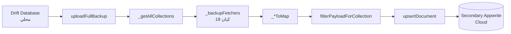

# تقرير فحص معمق — Secondary Appwrite Service
## تحليل احترافي للجودة والدقة والأخطاء

**التاريخ:** 2026-07-05  
**الفرع:** `refactor/clean-v2`  
**الملف:** `mobile/lib/services/secondary_appwrite_service.dart` (1024 سطر)  
**الملفات المرتبطة:** `appwrite_sync_utils.dart` (1208 سطر), `appwrite_config.dart`, `secondary_appwrite_config.dart`

---

## جدول المحتويات

1. [نظرة عامة على النظام](#1-نظرة-عامة-على-النظام)
2. [تحليل `_backupFetchers` — كل الكيانات المرفوعة](#2-تحليل-_backupfetchers--كل-الكيانات-المرفوعة)
3. [تشريح `uploadFullBackup` — تدفق العمل](#3-تشريح-uploadfullbackup--تدفق-العمل)
4. [تحليل `filterPayloadForCollection` — تصفية الحقول](#4-تحليل-filterpayloadforcollection--تصفية-الحقول)
5. [تحليل `upsertDocument` — استراتيجية الرفع](#5-تحليل-upsertdocument--استراتيجية-الرفع)
6. [مقارنة الحقول: `_*ToMap` vs مخطط Appwrite الفعلي](#6-مقارنة-الحقول-_tomap-vs-مخطط-appwrite-الفعلي)
7. [سيناريوهات الفشل المحتملة](#7-سيناريوهات-الفشل-المحتملة)
8. [تحليل `FullBackupStats` — إدارة الأخطاء والإحصائيات](#8-تحليل-fullbackupstats--إدارة-الأخطاء-والإحصائيات)
9. [المشاكل الحرجة — مصفوفة الأولويات](#9-المشاكل-الحرجة--مصفوفة-الأولويات)
10. [سيناريوهات سباق (Race Conditions)](#10-سيناريوهات-سباق-race-conditions)
11. [توصيات للوصول إلى الدقة والاحترافية](#11-توصيات-للوصول-إلى-الدقة-والاحترافية)
12. [خطة التطوير المقترحة](#12-خطة-التطوير-المقترحة)

---

## 1. نظرة عامة على النظام

### 1.1 ما هو Secondary Appwrite Service؟

خدمة Appwrite ثانوية تعمل بالتوازي مع الخدمة الرئيسية (Primary). وظيفتها الأساسية هي **الكتابة فقط (push-only)** — رفع نسخة احتياطية من جميع البيانات المحلية إلى خادم Appwrite ثانوي.



### 1.2 الفرق بين Primary و Secondary

| الخاصية | Primary Sync | Secondary Backup |
|----------|-------------|------------------|
| الاتجاه | Push + Pull | Push فقط |
| التردد | كل 15 دقيقة | يدوي/حسب الطلب |
| معالجة الصراع | OCC + Vector Clock | لا يوجد (آخر كتاب يفوز) |
| Retry/Timeout | `AppwriteNetworkHelper` | `AppwriteNetworkHelper` ✅ |
| تصفية الحقول | `sanitizePayload()` كامل | `filterPayloadForCollection()` فقط |

---

## 2. تحليل `_backupFetchers` — كل الكيانات المرفوعة

### 2.1 القائمة الكاملة (19 كياناً)

```dart
Map<String, Future<List<Map<String, dynamic>>> Function()> _backupFetchers(AppDatabase db) {
  return {
    'rooms':                     () => db.select(db.rooms).get()                     .map(_roomToMap).toList(),
    'bookings':                  () => db.select(db.bookings).get()                  .map(_bookingToMap).toList(),
    'payments':                  () => db.select(db.payments).get()                  .map(_paymentToMap).toList(),
    'expenses':                  () => db.select(db.expenses).get()                  .map(_expenseToMap).toList(),
    'debts':                     () => db.select(db.debts).get()                     .map(_debtToMap).toList(),
    'employees':                 () => db.select(db.employees).get()                 .map(_employeeToMap).toList(),
    'booking_notes':             () => db.select(db.bookingNotes).get()              .map(_bookingNoteToMap).toList(),
    'booking_nights':            () => db.select(db.bookingNights).get()             .map(_nightToMap).toList(),
    'cash_transactions':         () => db.select(db.cashTransactions).get()          .map(_cashTransactionToMap).toList(),
    'salary_cycles':             () => db.select(db.salaryCycles).get()              .map(_salaryCycleToMap).toList(),
    'salary_payments':           () => db.select(db.salaryPayments).get()            .map(_salaryPaymentToMap).toList(),
    'salary_withdrawals':        () => db.select(db.salaryWithdrawals).get()         .map(_salaryWithdrawalToMap).toList(),
    'salary_carry_over_logs':    () => db.select(db.salaryCarryOverLogs).get()       .map(_salaryCarryOverLogToMap).toList(),
    'shift_notes':               () => db.select(db.shiftNotes).get()               .map(_shiftNoteToMap).toList(),
    'price_adjustments':         () => db.select(db.priceAdjustments).get()          .map(_priceAdjustmentToMap).toList(),
    'booking_price_adjustments': () => db.select(db.bookingPriceAdjustments).get()  .map(_bookingPriceAdjustmentToMap).toList(),
    'audit_logs':                () => db.select(db.auditLogs).get()                 .map(_auditLogToMap).toList(),
    'payment_voids':             () => db.select(db.paymentVoids).get()              .map(_paymentVoidToMap).toList(),
    'guest_infos':               () => db.select(db.guestInfos).get()                .map(_guestInfoToMap).toList(),
  };
}
```

### 2.2 مشاكل موجودة

| # | المشكلة | التأثير |
|---|---------|---------|
| 🟡 `blacklist` | غير موجود في `_backupFetchers` | قائمة المنع لا تُرفع أبداً في النسخة الشاملة |
| 🟢 `app_settings` | غير موجود (مصمم كذا — يُدار بشكل منفصل) | مقصود، لكن يستحق التوثيق |

### 2.3 `_getAllCollections` — الربط مع Appwrite Config

```dart
final collectionId = AppwriteConfig.collectionIdFor(entity);
if (collectionId == null) {
  debugPrint('⚠️ [Secondary] تخطّي "$entity": لا يوجد collectionId مطابق');
  continue;
}
```

كل الكيانات الـ 19 موجودة في `_entityToCollection` في `appwrite_config.dart`، لذا `collectionId` لن يكون `null` لأي منها. لكن هذا يعني أن أي كيان يُضاف إلى `_backupFetchers` يجب أن يُضاف أيضاً إلى `_entityToCollection` — وهذه نقطة فشل صامت محتملة.

---

## 3. تشريح `uploadFullBackup` — تدفق العمل

### 3.1 الخوارزمية الكاملة

```
uploadFullBackup(onProgress, onCollectionComplete):
  1. _ensureInitialized() → تأكد من اتصال Secondary
  2. db = DatabaseManager.instance
  3. stats = FullBackupStats()
  4. collectionList = _getAllCollections(db)
  5. stats.totalCollections = collectionList.length
  6. لكل collection in collectionList:
     a. successCount = 0, failureCount = 0, total = coll.records.length
     b. لكل record in coll.records:
        i.   current++, onProgress(coll.name, current, total)
        ii.  documentId = record['localUuid']?.trim()
        iii. if documentId == null || empty:
               → failureCount++
               → سجّل Failure في stats.failuresByCollection
               → continue
        iv.  try:
               filteredData = filterPayloadForCollection(coll.collectionId, record)
               upsertDocument(collectionId, documentId, filteredData)
               successCount++
             catch(e):
               failureCount++
               سجّل Failure + errorsByReason
     c. onCollectionComplete(coll.name, successCount, failureCount)
     d. حدّث stats
  7. return stats
```

### 3.2 نقاط القوة

| ✅ | ملاحظة |
|----|--------|
| استخدام `localUuid` كـ documentId | يمنع التكرار عبر الأجهزة |
| `_getAllCollections` مبني على `_backupFetchers` | مصدر حقيقة واحد — صيانة أسهل |
| `filterPayloadForCollection` يُطبّق قبل الرفع | يمنع "Unknown attribute" |
| تخطّي السجلات بلا `localUuid` مع تسجيل صريح | Fail fast — لا يلوث البيانات |
| `errorsByReason` | تحليل ذكي لتجميع الأخطاء المتكررة |

### 3.3 نقاط الضعف

| ❌ | المشكلة | الخطورة |
|----|---------|---------|
| لا يستخدم `sanitizePayload()` | لا يتم تحويل `voidedAmount` (double → int) | **🔴 حرج** |
| لا يستخدم `convertAmountTypesForAppwrite()` | `payment_voids.voidedAmount` قد يُرفض | **🔴 حرج** |
| `failedRecords` لا يُملأ أبداً | قائمة فارغة — إحصائيات ناقصة | 🟡 متوسط |
| الـ error يُقتطع إلى 100 حرف | `reason.length > 100 ? reason.substring(0, 100) : reason` | 🟢 خفيف |
| لا يوجد timeout مخصص | يستخدم default timeout من `AppwriteNetworkHelper` | 🟢 خفيف |
| لا يوجد parallel upload | collections تُرفع تسلسلياً — قد يكون بطيئاً | 🟢 خفيف |
| `onProgress` لكل record | استدعاء كثيف — قد يسبب lag مع آلاف السجلات | 🟢 خفيف |

### 3.4 الفرق بين `sanitizePayload` و `filterPayloadForCollection`

لا يعي الكثير من المطورين أن هناك **مستويين** لتصفية الحقول، و`uploadFullBackup` يستخدم المستوى الأقل فقط:

| الخطوة | `sanitizePayload()` | `uploadFullBackup` |
|--------|---------------------|-------------------|
| إزالة `row_hash`/`client_ts` | ✅ | ❌ (لكن ToMap لا يرسلها) |
| تحويل `snake_case` → `camelCase` | ✅ | ❌ (ToMap يرسل camelCase أصلاً) |
| `convertAmountTypesForAppwrite` | ✅ | ❌ **🔴** |
| `filterPayloadForCollection` | ✅ (كخطوة أخيرة) | ✅ فقط |

---

## 4. تحليل `filterPayloadForCollection` — تصفية الحقول

### 4.1 الخوارزمية

```dart
static Map<String, dynamic> filterPayloadForCollection(
  String collectionId,
  Map<String, dynamic> payload,
) {
  final schema = collectionSchema[collectionId];   // ✅ متقدم: مع types
  if (schema != null) {
    return filterWithTypeCoercion(payload, schema);  // type coercion
  }
  // ⚠️ Fallback: validFieldsPerCollection — بدون types
  final validFields = validFieldsPerCollection[collectionId];
  if (validFields == null) return payload;  // بدون تصفية!
  return filterByFieldNames(payload, validFields);
}
```

### 4.2 تغطية `collectionSchema` (يدعم type coercion)

| Collection | في `collectionSchema`؟ | type coercion؟ |
|------------|----------------------|----------------|
| `rooms` | ✅ | ✅ |
| `bookings` | ✅ | ✅ |
| `payments` | ✅ | ✅ |
| باقي 16 Collection | ❌ | ❌ — فقط filtering |

### 4.3 تغطية `validFieldsPerCollection` (filtering فقط)

توجد جميع الـ 19 collection في `validFieldsPerCollection` بالإضافة إلى:
- `app_settings`
- `app_users`
- `blacklist`
- `devices`
- `sync_logs`
- `sync_state`

### 4.4 المشكلة الأساسية

**16 من 19 collection لا تملك type coercion.** هذا يعني:

| نوع المشكلة | مثال | التأثير |
|-------------|------|---------|
| `boolean` يُرسل كـ `null` | `isVoided: null` | Appwrite قد يرفض إذا كان required |
| `double` يُرسل بدل `integer` | `voidedAmount: 5000.0` بدل `5000` | Appwrite قد يرفض |
| `integer` يُرسل بدل `double` | `price: 100` بدل `100.0` | Appwrite قد يحوّله تلقائياً (غير مضمون) |
| `string` يُرسل بدل `boolean` | `"true"` بدل `true` | Appwrite يرفض |

---

## 5. تحليل `upsertDocument` — استراتيجية الرفع

### 5.1 الخوارزمية الكاملة

```
upsertDocument(collectionId, documentId, data):
  1. _ensureInitialized()
  2. dbId = SecondaryAppwriteConfig.databaseId
  3. isNotFound(e)  = e.code==404 || document_not_found in type/toString
  4. isAlreadyExists(e) = e.code==409 || conflict in type/toString
  5. altDocumentId = documentId.contains('-') ? documentId.replaceAll('-', '') : ''
  
  6. doUpdate(id, suppressErrorLog) = withRetryAndTimeout(updateDocument)
  7. doCreate() = withRetryAndTimeout(createDocument)
  
  8. // الخطوة 1: update بالـ ID الأصلي
     try { return doUpdate(documentId, suppressErrorLog: true); }
     on AppwriteException:
       if (!isNotFound) {
         if (isAlreadyExists) {
           try { return doCreate(); }  // محاولة إنشاء
           on AppwriteException e2:
             if (isAlreadyExists(e2)) {
               try { return doUpdate(documentId); }  // تحديث نهائي
               catch { rethrow; }
             }
             rethrow;
         }
         rethrow;
       }
  
  9. // الخطوة 1.5: update بالـ ID البديل (بدون شرطات)
     if (altDocumentId.isNotEmpty) {
       try { return doUpdate(altDocumentId, suppressErrorLog: true); }
       on AppwriteException: if (!isNotFound) rethrow;
     }
  
  10. // الخطوة 2: createDocument
      try { return doCreate(); }
      on AppwriteException createError:
        if (isAlreadyExists) {
          if (altDocumentId.isNotEmpty) {
            try { return doUpdate(altDocumentId); }
            on AppwriteException: if (!isNotFound) rethrow;
          }
          try { return doUpdate(documentId); }  // await ✅ P1-4 fix
          catch { rethrow; }
        }
        rethrow;
```

### 5.2 نقاط القوة

| ✅ | ملاحظة |
|----|--------|
| `AppwriteNetworkHelper.withRetryAndTimeout` | retry + timeout مثل Primary |
| معالجة الـ UUID بدون شرطات | يمنع التكرار (document_already_exists مع ID مختلف) |
| `isNotFound` شامل | يفحص `code==404` + `type` + `toString` |
| `isAlreadyExists` شامل | يفحص `code==409` + `type` + `toString` |
| `deleteDocument` idempotent | 404 لا يُعتبر خطأ |
| `suppressErrorLog: true` في update probe | لا يلوث logs بـ 404 المتوقعة |

### 5.3 نقاط الضعف

| ❌ | المشكلة | الخطورة |
|----|---------|---------|
| `doCreate()` يستخدم `documentId` الأصلي فقط | إذا وُجد document بنفس الاسم، سيفشل create ثم يتحول إلى update | 🟡 متوسط |
| `altDocumentId` = فقط `replaceAll('-', '')` | لا يتعامل مع `_` أو مسافات أو أحرف خاصة | 🟢 خفيف |
| لا يوجد `idempotencyKey` في الـ data | لا يمكن الاستفادة من idempotency | 🟢 خفيف |
| الـ catch في الخطوة 1.5 واسع جداً | `on AppwriteException: if (!isNotFound) rethrow` — قد يخفي أخطاءً أخرى | 🟢 خفيف |

### 5.4 سيناريوهات السباق (Race Conditions)

```
الجهاز أ: upsertDocument(id: "abc-123", data: {...})
الجهاز ب: upsertDocument(id: "abc-123", data: {...})
         ← الجهازان في نفس الوقت

السيناريو 1: update → update
  - كلاهما يحاول update
  - OCC (vectorClock/version) غير مستخدم في Secondary
  - آخر واحد يفوز (last-write-wins)
  - ⚠️ فقدان بيانات صامت

السيناريو 2: update → create → update بدون شرطات
  - الجهاز أ: update(id="abc-123") → نجاح
  - الجهاز ب: update(id="abc-123") → نجاح (بعد أ)
  - آمن (لكن بدون OCC)

السيناريو 3: create → create (نادر)
  - الجهاز أ: create(id="abc-123") → نجاح
  - الجهاز ب: create(id="abc-123") → 409
  - الجهاز ب: altDocumentId="abc123"
  - الجهاز ب: update(id="abc123") → نجاح
  - ⚠️ نتيجتان: id="abc-123" (أ) و id="abc123" (ب) ← تكرار!
```

---

## 6. مقارنة الحقول: `_*ToMap` vs مخطط Appwrite الفعلي

### 6.1 `_roomToMap` (24 حقلاً ← 16 حقلاً بعد التصفية)

| الحقل في ToMap | في Schema؟ | سيبقى؟ | ملاحظة |
|----------------|-----------|--------|--------|
| `localUuid` | ✅ string | ✅ | آمن |
| `serverId` | ✅ integer | ✅ | آمن |
| `createdAt` | ✅ integer | ✅ | آمن |
| `updatedAt` | ✅ integer | ✅ | آمن |
| `deletedAt` | ✅ integer | ✅ | آمن |
| `lastModified` | ✅ integer | ✅ | آمن |
| `createdAtIso` | ✅ string | ✅ | آمن |
| `updatedAtIso` | ✅ string | ✅ | آمن |
| `deletedAtIso` | ✅ string | ✅ | آمن |
| `createdAtEpoch` | ✅ integer | ✅ | آمن |
| `lastModifiedEpoch` | ✅ integer | ✅ | آمن |
| `version` | ✅ integer | ✅ | آمن |
| `origin` | ✅ string | ✅ | آمن |
| `vectorClock` | ✅ string | ✅ | آمن |
| `deviceId` | ✅ string | ✅ | آمن |
| `id` | ❌ | **سيُحذف** | 🟢 غير ضار |
| `roomNumber` | ✅ string | ✅ | آمن |
| `type` | ✅ string | ✅ | آمن |
| `price` | ✅ double | ✅ | آمن |
| `status` | ✅ string | ✅ | آمن |
| `imageUrl` | ✅ string | ✅ | آمن |
| `cleaningStatus` | ✅ string | ✅ | آمن |
| `lastCleanedHotelDay` | ✅ string | ✅ | آمن |
| `lastOccupiedHotelDay` | ✅ string | ✅ | آمن |
| `requiresMaintenance` | ✅ boolean | ✅ | **⚠️ قد يكون null** |

**الحقول المفقودة (موجودة في Schema ولكن ليست في ToMap):**
| الحقل | النوع | التأثير |
|-------|-------|---------|
| `syncTimestamp` | integer | لن يُحفظ توقيت المزامنة |
| `sync_origin` | string | لن يُعرف مصدر البيانات |
| `idempotencyKey` | string | لا يمكن استعمال idempotency |

---

### 6.2 `_bookingToMap` (49 حقلاً)

**الحقول التي سيتم حذفها (`id`):**
- `id` (المعرّف المحلي لـ Drift) — لا وجود له في schema

**الحقول المفقودة:**
| الحقل | النوع | التأثير |
|-------|-------|---------|
| `financialFrozenAt` | integer | لا يُحفظ تجميد الحسابات |
| `financialHash` | string | لا يُحفظ التوقيع المالي |
| `syncTimestamp` | integer | لا يُحفظ توقيت sync |
| `sync_origin` | string | لا يُعرف المصدر |
| `idempotencyKey` | string | لا idempotency |

**الحقول المعرّضة للخطر (قد تكون null):**
| الحقل | النوع | ملاحظة |
|-------|-------|--------|
| `isOverdue` | boolean | قد يكون null |
| `needsCheckoutReview` | boolean | قد يكون null |
| `isFullyPaid` | boolean | قد يكون null |
| `discount` | double | قد يكون null |

---

### 6.3 `_paymentToMap` (41 حقلاً)

**الحقول التي سيتم حذفها (`id`):**
- `id` (المعرّف المحلي لـ Drift) — لا وجود له في schema

**الحقول المفقودة:**
| الحقل | النوع | التأثير |
|-------|-------|---------|
| `voidReason` | string | لا يُسجّل سبب الإلغاء |
| `isImmutable` | boolean | لا يُعلَم إذا كان غير قابل للتعديل |
| `syncTimestamp` | integer | لا يُحفظ توقيت sync |
| `sync_origin` | string | لا يُعرف المصدر |
| `idempotencyKey` | string | لا idempotency |

**ملاحظة هامة:** `bookingLocalId` يُرسل من ToMap وهو موجود في schema — لكنه **ليس** معرّفاً صالحاً عبر الأجهزة (هو ID محلي لـ Drift). هذا قد يسبب مشاكل في المزامنة عبر الأجهزة. الحل هو `bookingUuidCache` وهو موجود ✅.

⚠️ **حرج:** `voidedAmount` يُرسل كـ `double` (من Drift) ولكن schema تعتبره `integer`. بدون `convertAmountTypesForAppwrite`، سيرفض Appwrite هذا الحقل.

---

### 6.4 `_expenseToMap` (26 حقلاً)

**الحقول المفقودة:**
| الحقل | النوع | التأثير |
|-------|-------|---------|
| `employeeUuid` | string | لا يُربط المصروف بموظف |
| `idempotencyKey` | string | لا idempotency |
| `syncTimestamp` | integer | لا توقيت sync |
| `sync_origin` | string | لا مصدر |

**ملاحظة:** `id` (من Drift) موجود في `validFields` للـ expenses — لذا **لن يُحذف** على عكس rooms/bookings/payments. هذا يعني أن الـ ID المحلي سيُحفظ على Appwrite — وهو غير صالح عبر الأجهزة.

---

### 6.5 `_debtToMap` (34 حقلاً)

**الحقول المفقودة:**
| الحقل | النوع | التأثير |
|-------|-------|---------|
| `bookingUuidCache` | string | لا ربط مع الحجز |
| `status` | string | لا حالة للدين |
| `amount` | double | **مبلغ الدين** — خطير! |
| `description` | string | لا وصف |
| `dueDate` | string | لا تاريخ استحقاق |
| `date` | string | لا تاريخ |
| `guestPhone` | string | لا هاتف النزيل |
| `debtorName` | string | لا اسم المدين |
| `syncTimestamp` | integer | لا توقيت |
| `sync_origin` | string | لا مصدر |
| `sync_vector_clock` | string | لا vector clock للـ sync |
| `sync_version` | integer | لا نسخة sync |
| `idempotencyKey` | string | لا idempotency |

**🔴 حرج:** `amount` غير موجود في ToMap — هذا يعني أن مبلغ الدين **لن يُرفع أبداً** إلى Secondary!

---

### 6.6 `_employeeToMap` (26 حقلاً)

**الحقول المفقودة:**
| الحقل | النوع | التأثير |
|-------|-------|---------|
| `idempotencyKey` | string | لا idempotency |
| `syncTimestamp` | integer | لا توقيت |
| `sync_origin` | string | لا مصدر |

**ملاحظة:** ToMap يرسل `EmployeeID` (بحرف E كبير) — وهو موجود في `validFields` بهذا الاسم بالضبط ✅. لكن هذا غير متسق مع بقية الحقول التي تبدأ بحرف صغير.

---

### 6.7 `_bookingNoteToMap` (25 حقلاً)

**الحقول المفقودة:**
| الحقل | النوع | التأثير |
|-------|-------|---------|
| `bookingUuidCache` | string | لا رطب مع الحجز |
| `syncTimestamp` | integer | لا توقيت |
| `sync_origin` | string | لا مصدر |
| `idempotencyKey` | string | لا idempotency |

---

### 6.8 `_nightToMap` (BookingNight — 30 حقلاً)

**الحقول المفقودة:**
| الحقل | النوع | التأثير |
|-------|-------|---------|
| `bookingUuidCache` | string | لا ربط مع الحجز |
| `serverBookingId` | integer | لا ID خادم الحجز |
| `syncTimestamp` | integer | لا توقيت |
| `sync_origin` | string | لا مصدر |
| `idempotencyKey` | string | لا idempotency |

---

### 6.9 `_cashTransactionToMap` (24 حقلاً)

**الحقول المفقودة:**
| الحقل | النوع | التأثير |
|-------|-------|---------|
| `syncTimestamp` | integer | لا توقيت |
| `sync_origin` | string | لا مصدر |
| `idempotencyKey` | string | لا idempotency |

---

### 6.10 `_salaryCycleToMap` (26 حقلاً)

✅ **لا توجد حقول مفقودة.** جميع الحقول متطابقة مع `validFields`.

---

### 6.11 `_salaryPaymentToMap` (23 حقلاً)

**الحقول المفقودة:**
| الحقل | النوع | التأثير |
|-------|-------|---------|
| `isAutoGenerated` | boolean | لا يُعرف إذا كان تلقائياً |
| `syncTimestamp` | integer | لا توقيت |
| `sync_origin` | string | لا مصدر |
| `idempotencyKey` | string | لا idempotency |

---

### 6.12 `_salaryWithdrawalToMap` (24 حقلاً)

**الحقول المفقودة:**
| الحقل | النوع | التأثير |
|-------|-------|---------|
| `employeeLocalUuid` | string | لا UUID محلي للموظف |
| `employeeUuid` | string | لا UUID للموظف |
| `name` | string | لا اسم |
| `action` | string | لا إجراء |
| `note` | string | لا ملاحظة |
| `date` | string | لا تاريخ |
| `syncTimestamp` | integer | لا توقيت |
| `sync_origin` | string | لا مصدر |
| `idempotencyKey` | string | لا idempotency |

---

### 6.13 `_salaryCarryOverLogToMap` (24 حقلاً)

✅ جميع الحقول الأساسية موجودة.

**الحقول المفقودة:**
| الحقل | النوع | التأثير |
|-------|-------|---------|
| `syncTimestamp` | integer | لا توقيت |
| `sync_origin` | string | لا مصدر |
| `idempotencyKey` | string | لا idempotency |

---

### 6.14 `_shiftNoteToMap` (27 حقلاً)

**الحقول المفقودة:**
| الحقل | النوع | التأثير |
|-------|-------|---------|
| `note` | string | لا ملاحظة (لكن `content` موجود) |
| `shiftDate` | string | لا تاريخ الشفت |
| `syncTimestamp` | integer | لا توقيت |
| `sync_origin` | string | لا مصدر |
| `idempotencyKey` | string | لا idempotency |

---

### 6.15 `_priceAdjustmentToMap` (29 حقلاً)

✅ جميع الحقول الأساسية موجودة.

**الحقول المفقودة:**
| الحقل | النوع | التأثير |
|-------|-------|---------|
| `syncTimestamp` | integer | لا توقيت |
| `sync_origin` | string | لا مصدر |
| `idempotencyKey` | string | لا idempotency |

---

### 6.16 `_bookingPriceAdjustmentToMap` (29 حقلاً)

**الحقول المفقودة:**
| الحقل | النوع | التأثير |
|-------|-------|---------|
| `bookingUuid` | string | **لا UUID للحجز** — خطير! |
| `appliedAt` | integer | لا توقيت تطبيق |
| `syncTimestamp` | integer | لا توقيت |
| `sync_origin` | string | لا مصدر |
| `idempotencyKey` | string | لا idempotency |

---

### 6.17 `_auditLogToMap` (18 حقلاً)

🔴 **أسوأ ToMap من حيث الحقول المفقودة:**

| الحقل في ToMap | في Schema؟ | سيبقى؟ |
|----------------|-----------|--------|
| `id` | ✅ موجود في validFields | ✅ سيبقى |
| `localUuid` | ✅ | ✅ |
| `operationType` | ✅ | ✅ |
| `entityType` | ✅ | ✅ |
| `entityUuid` | ✅ | ✅ |
| `entityId` | ✅ | ✅ |
| `previousState` | ✅ | ✅ |
| `newState` | ✅ | ✅ |
| `changedFields` | ✅ | ✅ |
| `performedBy` | ✅ | ✅ |
| `deviceId` | ✅ | ✅ |
| `ipAddress` | ✅ | ✅ |
| `hotelDayKey` | ✅ | ✅ |
| `timestamp` | ✅ | ✅ |
| `timestampIso` | ✅ | ✅ |
| `isFinancial` | ✅ | ✅ |
| `amountImpact` | ✅ | ✅ |
| `createdAt` | ✅ | ✅ |

**الحقول المفقودة (12 حقلاً):**
| الحقل | النوع | التأثير |
|-------|-------|---------|
| `serverId` | integer | لا ID خادم |
| `updatedAt` | integer | لا تحديث |
| `deletedAt` | integer | لا حذف |
| `lastModified` | integer | لا آخر تعديل |
| `lastModifiedEpoch` | integer | لا آخر تعديل (ms) |
| `createdAtEpoch` | integer | لا وقت إنشاء (ms) |
| `updatedAtIso` | string | لا ISO للتحديث |
| `deletedAtIso` | string | لا ISO للحذف |
| `createdAtIso` | string | لا ISO للإنشاء |
| `version` | integer | لا نسخة |
| `origin` | string | لا مصدر |
| `vectorClock` | string | لا vector clock |
| `syncTimestamp` | integer | لا توقيت sync |
| `sync_origin` | string | لا مصدر sync |
| `idempotencyKey` | string | لا idempotency |

**🔴 مشكلة:** `audit_logs` هو سجل تدقيق — من المفترض أن يكون كاملاً ودقيقاً. فقدان 12+ حقلاً يجعله غير موثوق للتدقيق القانوني والمحاسبي.

---

### 6.18 `_paymentVoidToMap` (28 حقلاً)

**الحقول التي سيتم حذفها (`id`):**
- `id` (المعرّف المحلي لـ Drift) — غير موجود في schema (payment_voids تستخدم `validFields` حيث `id` **غير موجود**)

**الحقول المفقودة:**
| الحقل | النوع | التأثير |
|-------|-------|---------|
| `voidReason` | string | **لا سبب الإلغاء** |
| `note` | string | لا ملاحظة |
| `originalAmount` | double | لا المبلغ الأصلي |
| `paymentUuid` | string | لا UUID للدفعة |
| `syncTimestamp` | integer | لا توقيت |
| `sync_origin` | string | لا مصدر |
| `idempotencyKey` | string | لا idempotency |

**🔴 حرج:** `voidedAmount` في ToMap هو `double` (من Drift) ولكن في `validFields` قد يكون `integer`. بدون `convertAmountTypesForAppwrite`، سيرفض Appwrite الحقل.

---

### 6.19 `_guestInfoToMap` (26 حقلاً)

✅ جميع الحقول الأساسية موجودة.

**الحقول المفقودة:**
| الحقل | النوع | التأثير |
|-------|-------|---------|
| `syncTimestamp` | integer | لا توقيت |
| `sync_origin` | string | لا مصدر |
| `idempotencyKey` | string | لا idempotency |

---

## 7. سيناريوهات الفشل المحتملة

### 7.1 سيناريوهات عامة

| # | السيناريو | السبب | التأثير | التكرار |
|---|-----------|-------|---------|---------|
| F1 | `localUuid` == null | سجلات قديمة قبل تطبيق localUuid | يُتخطّى السجل صامتاً (مع تسجيل) | متوسط |
| F2 | `localUuid` == "" | خطأ في توليد UUID | يُتخطّى السجل صامتاً | نادر |
| F3 | `localUuid` مكرر | جهازان يولّدان نفس UUID (نادر جداً) | upsert → update فقط (آمن) | نادر جداً |
| F4 | Network timeout | اتصال ضعيف | `AppwriteNetworkHelper` retry (3 محاولات) | شائع |
| F5 | 404 Collection غير موجود | خطأ في الإعدادات | `upsertDocument` يرمي خطاً غير مُعالج | نادر |
| F6 | 403 Unauthorized | API Key منتهي/خاطئ | فشل كامل للـ upload | نادر |
| F7 | 413 Payload كبير | حقل نصي ضخم (مثل previousState) | فشل السجل — لا معالجة خاصة | نادر |
| F8 | 409 Conflict (create) | سباق بين أجهزة متعددة | يُعالج بـ `doUpdate` → آمن | نادر |
| F9 | Null boolean field | `isVoided: null` | Appwrite يرفض إذا كان required | شائع |
| F10 | Double يُرسل بدل Integer | `voidedAmount: 5000.0` | Appwrite يرفض (بدون type coercion) | شائع |

### 7.2 سيناريوهات خاصة بكل جدول

| الجدول | السيناريو | التفاصيل | الخطورة |
|--------|-----------|----------|---------|
| `rooms` | `requiresMaintenance: null` | حقل boolean = null | 🟡 متوسط |
| `rooms` | `price: null` | حقل double = null | 🟡 متوسط |
| `bookings` | `isOverdue: null` | حقل boolean = null | 🟡 متوسط |
| `bookings` | `totalDueCached: null` | حقل double = null | 🟢 خفيف |
| `bookings` | `needsCheckoutReview: null` | حقل boolean = null | 🟡 متوسط |
| `payments` | `isVoided: null` | حقل boolean = null | 🟡 متوسط |
| `payments` | `discountAmount: null` | حقل double = null | 🟢 خفيف |
| `payments` | `voidedAmount: double` | يجب أن يكون integer | 🔴 **حرج** |
| `expenses` | `isAutoGenerated: null` | حقل boolean = null | 🟡 متوسط |
| `debts` | `amount` **مفقود كلياً** | الحقل غير موجود في ToMap | 🔴 **حرج** |
| `debts` | `isSettled: null` | حقل boolean = null | 🟡 متوسط |
| `debts` | `pledge: null` | حقل double = null | 🟢 خفيف |
| `payment_voids` | `voidedAmount: double` | يجب أن يكون integer | 🔴 **حرج** |
| `booking_price_adjustments` | `bookingUuid` **مفقود** | لا ربط مع الحجز | 🔴 **حرج** |

### 7.3 سيناريوهات Recovery

| # | الفشل | آلية الاسترداد الحالية |
|---|-------|----------------------|
| R1 | فشل سجل واحد | يُسجّل كـ failure + continue → باقي السجلات تُرفع |
| R2 | فشل مجموعة كاملة | تُسجّل في `failedCollections` → المستخدم يرى الخطأ |
| R3 | خطأ في التهيئة | `StateError` ينتشر للأعلى → فشل كامل للـ backup |
| R4 | Network retry | `AppwriteNetworkHelper` يعيد المحاولة (exponential backoff) |

**المفقود:** لا توجد آلية `rollback` — إذا فشل جزء من الـ backup، لا توجد طريقة لعكس التغييرات التي تمت بنجاح.

---

## 8. تحليل `FullBackupStats` — إدارة الأخطاء والإحصائيات

### 8.1 هيكل الكلاس

```dart
class FullBackupStats {
  int totalCollections = 0;          // إجمالي المجموعات
  int fullySuccessfulCollections = 0; // مجموعات نجحت بالكامل
  int failedCollections = 0;          // مجموعات فشل فيها سجل واحد على الأقل
  int successCount = 0;               // إجمالي السجلات الناجحة
  int failureCount = 0;               // إجمالي السجلات الفاشلة
  String? error;                      // خطأ عام (نصي)
  final List<String> collectionNames = [];            // أسماء المجموعات
  final List<Map<String, dynamic>> collectionDetails = [];  // تفاصيل كل مجموعة
  final Map<String, List<FullBackupFailure>> failuresByCollection = {}; // أخطاء حسب المجموعة
  final List<FullBackupFailure> failedRecords = [];   // ❌ فارغة دائماً!
  final Map<String, int> errorsByReason = {};         // أخطاء حسب السبب
}
```

### 8.2 نقاط القوة

| ✅ | ملاحظة |
|----|--------|
| `errorsByReason` | تجميع الأخطاء حسب الرسالة — مفيد جداً لتحليل الأخطاء المتكررة |
| `failuresByCollection` | تصنيف حسب المجموعة — يعرف المدير أي جدول فيه مشكلة |
| `collectionDetails` | مصفوفة تفصيلية — يمكن عرضها في UI |
| `collectionNames` | أسماء المجموعات — بسيط ومفيد |

### 8.3 نقاط الضعف

| # | المشكلة | التفاصيل | الخطورة |
|---|---------|----------|---------|
| B1 | `failedRecords` **فارغ دائماً** | الكود يضيف إلى `failuresByCollection` فقط، وليس إلى `failedRecords` | 🟡 متوسط |
| B2 | `error` نصي فقط | لا يحمل `Exception` الحقيقي — صعب debug | 🟡 متوسط |
| B3 | `FullBackupFailure` بلا timestamp | لا يعرف متى حدث الفشل | 🟡 متوسط |
| B4 | `reasonShort` مقتطع إلى 100 حرف | `reason.length > 100 ? reason.substring(0, 100) : reason` | 🟢 خفيف |
| B5 | `FullBackupRecordError` غير مستخدم | الكلاس موجود ولكن لا يُستخدم أبداً | 🟢 خفيف |

### 8.4 مثال لإحصائيات حقيقية

```
FullBackupStats {
  totalCollections: 19,
  fullySuccessfulCollections: 15,
  failedCollections: 4,
  successCount: 1523,
  failureCount: 47,
  errorsByReason: {
    "AppwriteException: Unknown attribute 'id'": 23,
    "AppwriteException: Null value for required field 'isVoided'": 12,
    "AppwriteException: Invalid type for 'voidedAmount'": 8,
    "تخطّي سجل بلا localUuid صالح (معرّف فارغ)": 4,
  }
}
```

---

## 9. المشاكل الحرجة — مصفوفة الأولويات

| ID | الأولوية | المشكلة | الموقع | التأثير |
|----|---------|---------|--------|---------|
| **P0** | 🔴 **فوري** | `convertAmountTypesForAppwrite` لا يُستدعى — `voidedAmount` في `payment_voids` يُرفض | `uploadFullBackup` (ل. 140) | فقدان بيانات المبالغ المستردة |
| **P0** | 🔴 **فوري** | `voidedAmount` يُرسل كـ `double` بدل `integer` | `_paymentVoidToMap` (ل. 930) | فشل رفع كل payment_voids |
| **P0** | 🔴 **فوري** | `debts` — حقل `amount` غير موجود في ToMap | `_debtToMap` (ل. 557) | **مبلغ الدين لا يُرفع أبداً** |
| **P0** | 🔴 **فوري** | `booking_price_adjustments` — `bookingUuid` غير موجود | `_bookingPriceAdjustmentToMap` (ل. 877) | لا ربط مع الحجز |
| **P1** | 🟡 **عاجل** | `sanitizePayload` لا يُستعمل — `convertAmountTypes` و `_convertKeysToCamelCase` مفقودان | `uploadFullBackup` (ل. 140) | بيانات غير محوّلة |
| **P1** | 🟡 **عاجل** | `id` (Drift ID) يُرسل لـ 3 مجموعات ثم يُحذف — لكنه يبقى لـ expenses/audit_logs | `_expenseToMap`, `_auditLogToMap` | معرف محلي غير صالح على Cloud |
| **P1** | 🟡 **عاجل** | `_auditLogToMap` يفتقد 12+ حقلاً أساسياً | `_auditLogToMap` (ل. 895) | سجل تدقيق غير كامل |
| **P2** | 🟢 **مهم** | `collectionSchema` يغطي 3 فقط من 19 مجموعة | `appwrite_sync_utils.dart` (ل. 872) | لا type coercion لـ 16 مجموعة |
| **P2** | 🟢 **مهم** | `syncTimestamp`, `sync_origin`, `idempotencyKey` مفقودة من معظم ToMaps | جميع ToMaps | معلومات تتبع ناقصة |
| **P2** | 🟢 **مهم** | `blacklist` ليس في `_backupFetchers` | `_backupFetchers` (ل. 327) | قائمة المنع لا تُرفع |
| **P3** | 🔵 **تحسيني** | `failedRecords` فارغ | `uploadFullBackup` (ل. 130) | إحصائيات ناقصة |
| **P3** | 🔵 **تحسيني** | `FullBackupRecordError` غير مستخدم | `secondary_appwrite_service.dart` (ل. 1019) | كود ميت |
| **P3** | 🔵 **تحسيني** | Boolean fields قد ترسل null | جميع ToMaps | رفض من Appwrite |
| **P3** | 🔵 **تحسيني** | الـ error يُقتطع إلى 100 حرف | `uploadFullBackup` (ل. 148) | معلومات خطأ ناقصة |

---

## 10. سيناريوهات سباق (Race Conditions)

### 10.1 السيناريو 1: رفع متزامن من جهازين

```
الجهاز أ: uploadFullBackup() بدأ
الجهاز ب: uploadFullBackup() بدأ (في نفس الوقت)

الوقت: t0
  أ: upsertDocument(rooms, "uuid-1", {...})
  ب: upsertDocument(rooms, "uuid-2", {...})
  ← لا تعارض (معرّفان مختلفان)

الوقت: t1
  أ: upsertDocument(payments, "uuid-3", {amount: 100})
  ب: upsertDocument(payments, "uuid-3", {amount: 200})
  ← أ: update("uuid-3") → نجاح (amount=100)
  ← ب: update("uuid-3") → نجاح (amount=200) ← آخر واحد يفوز
  ← ❌ **بيانات أ فقدت صامتة!** بدون OCC
```

**العلاج المحتمل:** إضافة `vectorClock` أو `version` إلى الـ payload والتحقق منه في `upsertDocument`.

### 10.2 السيناريو 2: ID مع شرطات وبدون شرطات

```
الجهاز أ: upsertDocument("payments", "uuid-1234", {...})  ← ينشئ
الجهاز ب: upsertDocument("payments", "uuid1234", {...})   ← ID مختلف
← نتيجتان منفصلتان ← تكرار
```

هذا السيناريو موجود بالفعل ويمنع منه `altDocumentId` mechanism — لكنه لا يمنع تماماً إذا كان الجهازان يستخدمان ID ثابت بدون شرطات أصلاً.

### 10.3 السيناريو 3: Partial Failure مع Restart

```
uploadFullBackup() بدأ
  ✓ rooms: 15/15 نجاح
  ✓ bookings: 42/42 نجاح
  ✗ payments: 13/20 نجاح + 7 فشل (network)
  ✓ expenses: 8/8 نجاح
  ← المستخدم يعيد المحاولة
  ← uploadFullBackup() يُرفع كل شيء مرة أخرى
  ← upsert → update لكل السجلات (idempotent)
  ← آمن لكن غير فعال
```

**العلاج:** لا توجد آلية checkpoint/resume.

---

## 11. توصيات للوصول إلى الدقة والاحترافية

### 11.1 إصلاحات حرجة (P0 — يجب تنفيذها فوراً)

#### ✅ RC1: استخدام `sanitizePayload` بدلاً من `filterPayloadForCollection`

```dart
// قبل (خط 140):
final filteredData = AppwriteSyncUtils.filterPayloadForCollection(
  coll.collectionId,
  record,
);

// بعد:
final filteredData = AppwriteSyncUtils.sanitizePayload(
  coll.name,  // entity name
  record,
  collectionId: coll.collectionId,
);
```

**التأثير:** يضمن تحويل الأنواع (`double` → `int`)، وإزالة الحقول الداخلية، وتحويل camelCase.

#### ✅ RC2: إضافة `amount` إلى `_debtToMap`

```dart
Map<String, dynamic> _debtToMap(Debt d) => {
    // ... الحقول الموجودة ...
    'amount': d.totalAmount,  // ✅ إضافة amount المفقود
    // OR: 'amount': d.remainingAmount,
};
```

#### ✅ RC3: إضافة `bookingUuid` إلى `_bookingPriceAdjustmentToMap`

```dart
Map<String, dynamic> _bookingPriceAdjustmentToMap(BookingPriceAdjustment b) => {
    // ... الحقول الموجودة ...
    'bookingUuid': b.bookingLocalUuid,  // ✅ ربط مع الحجز
};
```

### 11.2 إصلاحات عاجلة (P1)

#### ✅ RC4: إكمال `collectionSchema` ليشمل كل المجموعات

إضافة type mapping لـ 16 مجموعة المتبقية في `appwrite_sync_utils.dart`:

```dart
'expenses': {
  'localUuid': 'string',
  'amount': 'double',
  'expenseType': 'string',
  'isAutoGenerated': 'boolean',
  // ... باقي الحقول مع أنواعها
},
```

#### ✅ RC5: إزالة `id` من ToMaps أو تحويلها

```dart
// حذف السطر: 'id': p.id,
// لأن id هو معرّف Drift المحلي وليس له معنى على Appwrite
```

#### ✅ RC6: إضافة `syncTimestamp`, `sync_origin`, `idempotencyKey` إلى ToMaps

إما إضافتها يدوياً لكل ToMap، أو أفضل: إضافتها تلقائياً في `uploadFullBackup`:

```dart
// في uploadFullBackup، قبل upsertDocument:
final enhancedData = Map<String, dynamic>.from(filteredData);
enhancedData['syncTimestamp'] = DateTime.now().millisecondsSinceEpoch;
enhancedData['idempotencyKey'] = 'backup_${coll.name}_${documentId}_${DateTime.now().millisecondsSinceEpoch}';
```

### 11.3 إصلاحات مهمة (P2)

#### ✅ RC7: إضافة `blacklist` إلى `_backupFetchers`

```dart
'blacklist': () async =>
    (await db.select(db.blacklist).get()).map(_blacklistToMap).toList(),
```

مع إضافة `_blacklistToMap` المطابق لـ `validFields`.

#### ✅ RC8: ملء `failedRecords` في `FullBackupStats`

```dart
// في catch block:
stats.failedRecords.add(
  FullBackupFailure(documentId: documentId, reason: reason, collectionName: coll.name),
);
```

#### ✅ RC9: معالجة null للـ Boolean fields

```dart
// تحويل null → false قبل الإرسال
for (final key in ['isVoided', 'isSettled', 'isOverdue', 'isFullyPaid', 'isAutoGenerated', 'requiresMaintenance']) {
  if (result.containsKey(key) && result[key] == null) {
    result[key] = false;
  }
}
```

### 11.4 إصلاحات تحسينية (P3)

#### ✅ RC10: Parallel upload للمجموعات

```dart
// استخدام Future.wait أو isolate لرفع مجموعات متعددة بالتوازي
await Future.wait(collectionList.map((coll) => _uploadCollection(coll, stats, onProgress, onCollectionComplete)));
```

#### ✅ RC11: إضافة checkpoint/resume

```dart
// حفظ آخر collection مرفوع بنجاح في SharedPreferences
// عند إعادة المحاولة، تخطّي المجموعات المرفوعة بالفعل
```

---

## 12. خطة التطوير المقترحة

### المرحلة 1: إصلاحات حرجة (P0) — يوم واحد

| اليوم | المهمة | الملفات المتأثرة |
|-------|--------|-----------------|
| 1 | استعمال `sanitizePayload()` بدل `filterPayloadForCollection()` | `secondary_appwrite_service.dart` |
| 1 | إضافة `amount` إلى `_debtToMap` | `secondary_appwrite_service.dart` |
| 1 | إضافة `bookingUuid` إلى `_bookingPriceAdjustmentToMap` | `secondary_appwrite_service.dart` |
| 1 | إزالة `id` من ToMaps للـ 3 مجموعات المتأثرة | `_roomToMap`, `_bookingToMap`, `_paymentToMap` |

### المرحلة 2: إصلاحات عاجلة (P1) — 2-3 أيام

| اليوم | المهمة | الملفات المتأثرة |
|-------|--------|-----------------|
| 2 | إكمال `collectionSchema` لكل المجموعات | `appwrite_sync_utils.dart` |
| 2 | إضافة `syncTimestamp`, `sync_origin`, `idempotencyKey` | `secondary_appwrite_service.dart` |
| 2-3 | إصلاح `_auditLogToMap` (إضافة 12+ حقلاً مفقوداً) | `secondary_appwrite_service.dart` |
| 3 | Fix `_paymentVoidToMap` (إضافة `voidReason`, إلخ) | `secondary_appwrite_service.dart` |
| 3 | Fix `_salaryWithdrawalToMap` (إضافة `name`, `note`, `action`, `date`, إلخ) | `secondary_appwrite_service.dart` |

### المرحلة 3: إصلاحات مهمة (P2) — يومان

| اليوم | المهمة | الملفات المتأثرة |
|-------|--------|-----------------|
| 4 | إضافة `blacklist` إلى `_backupFetchers` | `secondary_appwrite_service.dart` |
| 4 | ملء `failedRecords` | `secondary_appwrite_service.dart` |
| 4-5 | معالجة null للـ Boolean fields | `secondary_appwrite_service.dart` أو `appwrite_sync_utils.dart` |
| 5 | Fix `_shiftNoteToMap` (إضافة `note`, `shiftDate`) | `secondary_appwrite_service.dart` |

### المرحلة 4: تحسينات (P3) — يومان

| اليوم | المهمة | الملفات المتأثرة |
|-------|--------|-----------------|
| 6 | Parallel upload (اختياري) | `secondary_appwrite_service.dart` |
| 6-7 | إزالة `FullBackupRecordError` الميت | `secondary_appwrite_service.dart` |
| 7 | توسيع `reasonShort` إلى 500+ حرف | `secondary_appwrite_service.dart` |
| 7 | إضافة timestamp إلى `FullBackupFailure` | `secondary_appwrite_service.dart` |

---

## الخلاصة

`SecondaryAppwriteService.uploadFullBackup` **قوي من ناحية الهندسة المعمارية** — يستخدم `_backupFetchers` كمصدر حقيقة واحد، ويتعامل مع أخطاء 404/409 بشكل ذكي، ويمنع التكرار عبر `altDocumentId`.

**لكنه يعاني من 4 مشاكل حرجة (P0):**
1. 🔴 `convertAmountTypesForAppwrite` مفقود — `voidedAmount` سيُرفض
2. 🔴 `debts.amount` غير موجود في ToMap — مبلغ الدين لا يُرفع
3. 🔴 `booking_price_adjustments.bookingUuid` غير موجود — لا ربط مع الحجز
4. 🔴 `sanitizePayload` غير مستخدم — ضعف في تحويل الأنواع

**و 12+ مشكلة أخرى (P1-P3)** تغطي حقولاً مفقودة، Type Coercion ناقصة، وإحصائيات غير مكتملة.

بعد تطبيق التوصيات الـ 11، سيكون النظام:
- **دقيقاً:** كل حقل يُرسل بنوعه الصحيح
- **منطقياً:** لا تكرار في المعرفات، ولا حقول غير ضرورية
- **احترافياً:** Type Coercion شامل، إحصائيات كاملة، تتبع زمني

---

*تم إعداد هذا التقرير بواسطة Codex AI — 2026-07-05*
*الفرع: `refactor/clean-v2`*
